*
 University of Cincinnati 
*
*
 Information Technology  
*
*
 Tech for Mobile apps  
  *
**<a align="center" href="https://dbms2704.herokuapp.com/">
#FITNESS APP
</a>**

# Teammates
- Sainadha Reddy Penugonda - M15890050  
- Archana Vankayalapati- M15801476

# Table of Contents
- [General info](#desc)
- [Run](#run)
- [Technologies Used](#pre)

# General info
FITNESS APP
- Clients approach
- Freelancers Approach

#How to run the code

## Then

Run The App

### npm start

Runs your app in development mode.

Open it in the [Expo app](https://expo.io) on your phone to view it. It will reload if you save edits to your files, and you will see build errors and logs in the terminal.

#### npm run ios

Like npm start / yarn start, but also attempts to open your app in the iOS Simulator if you're on a Mac and have it installed.

#### npm run android or npx expo start and then press a to run on android

Like npm start / yarn start, but also attempts to open your app on a connected Android device or emulator. Requires an installation of Android build tools (see [React Native docs](https://facebook.github.io/react-native/docs/getting-started.html) for detailed setup).

Open the Source code folder and open hire book code in your editor and
$ npm i
$ npm run expo ..
Open localhost: and to find the magic

This is the Home Page of the output

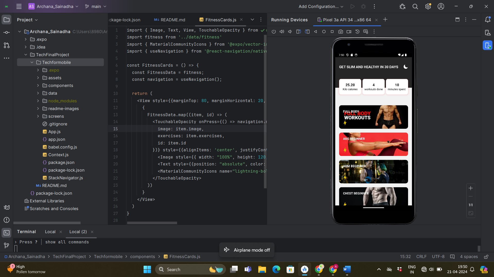

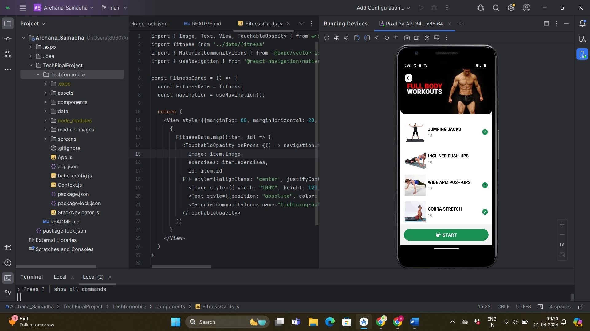

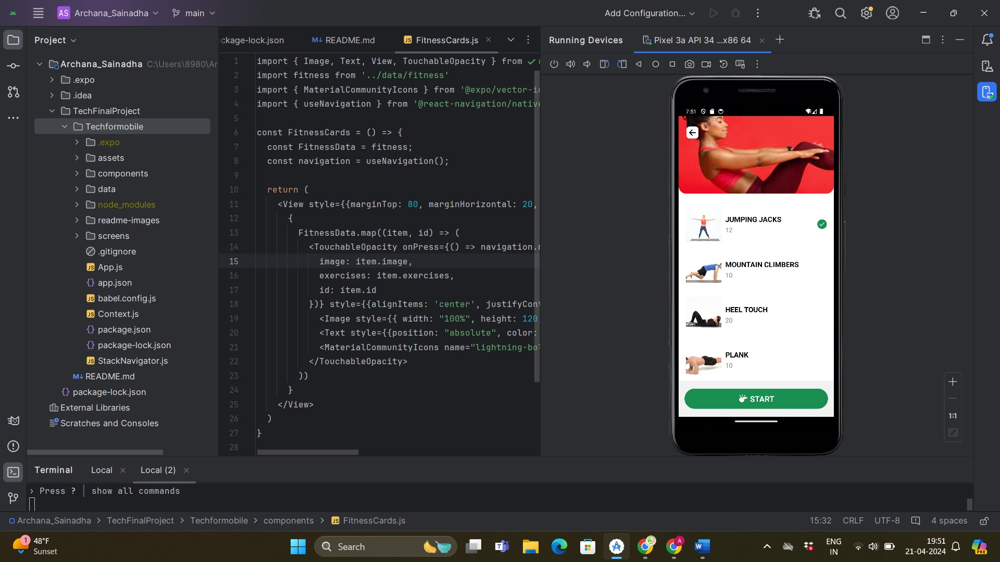

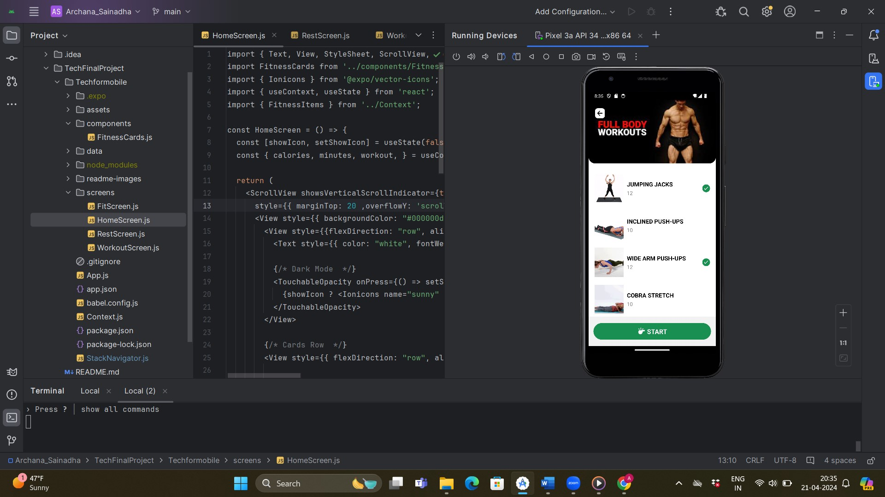

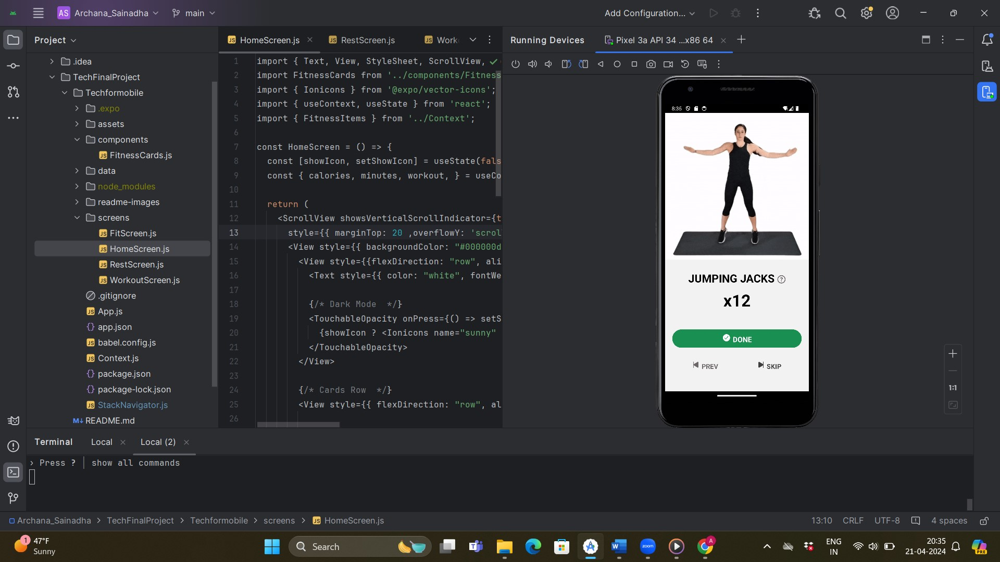

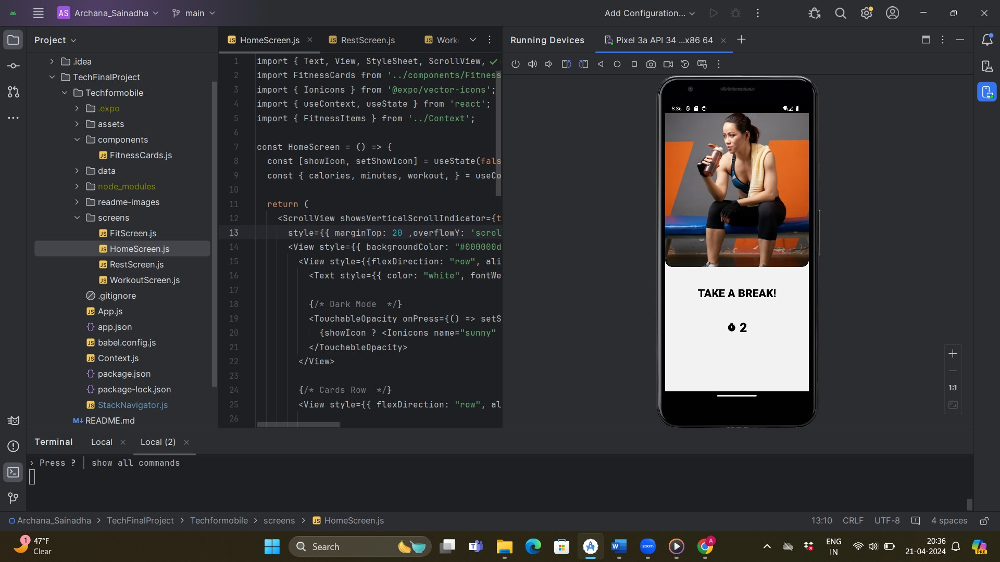

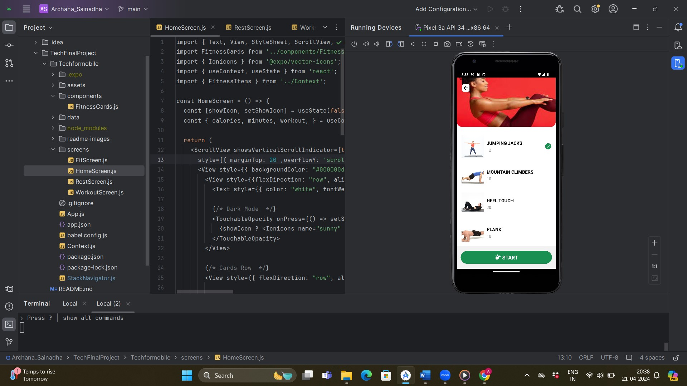

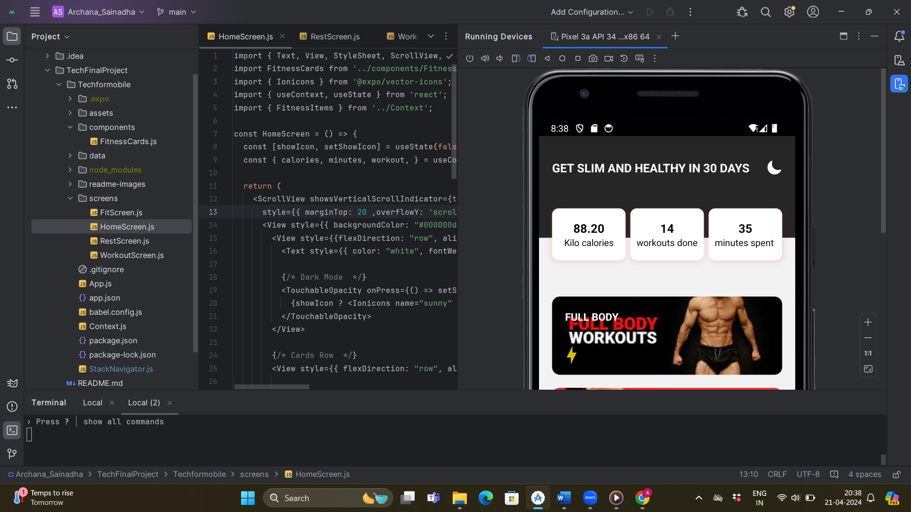

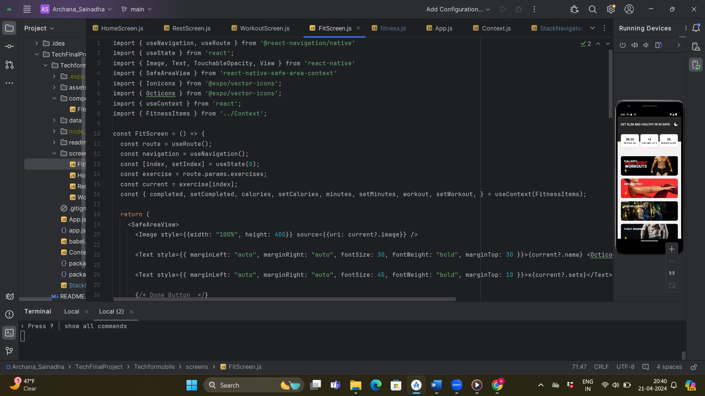

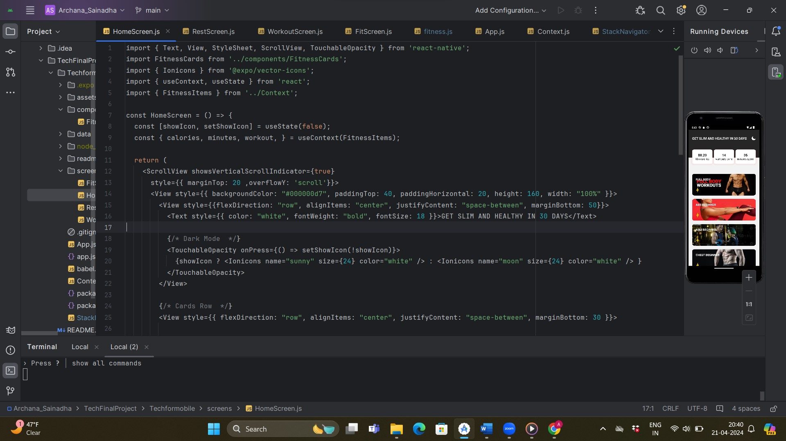

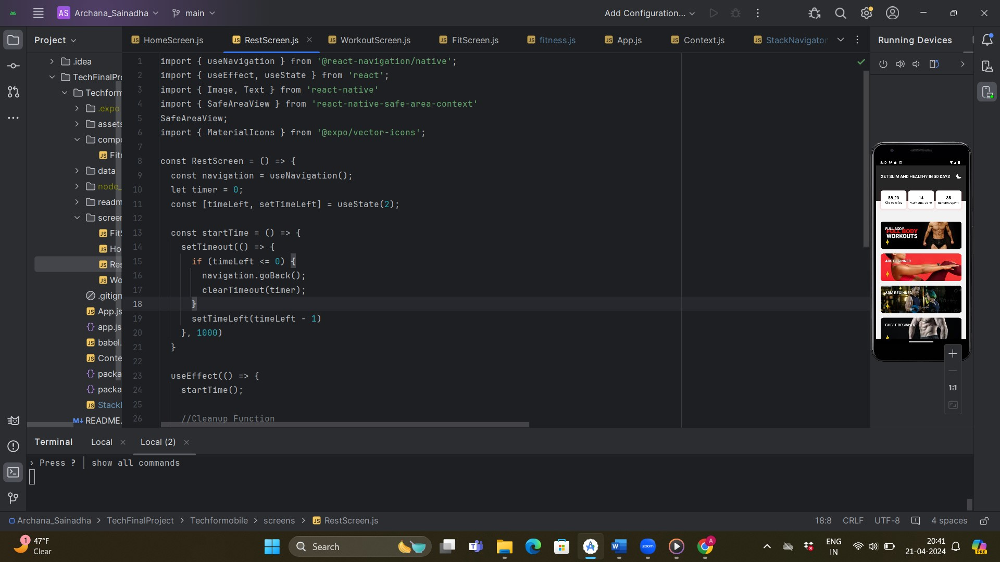

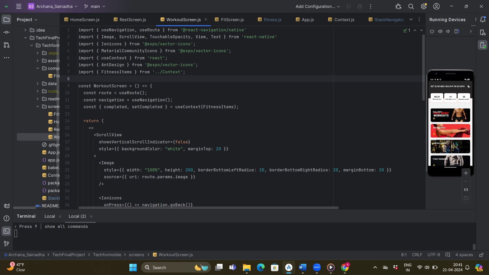

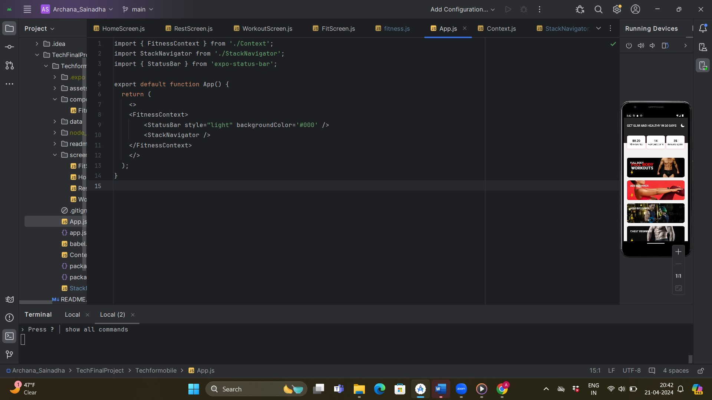

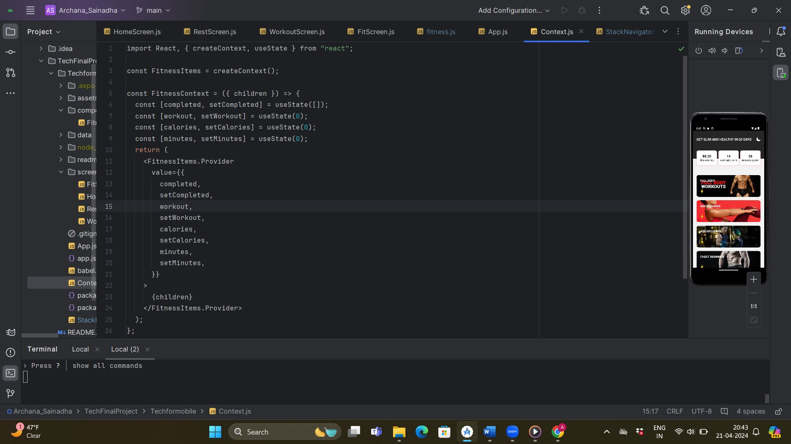

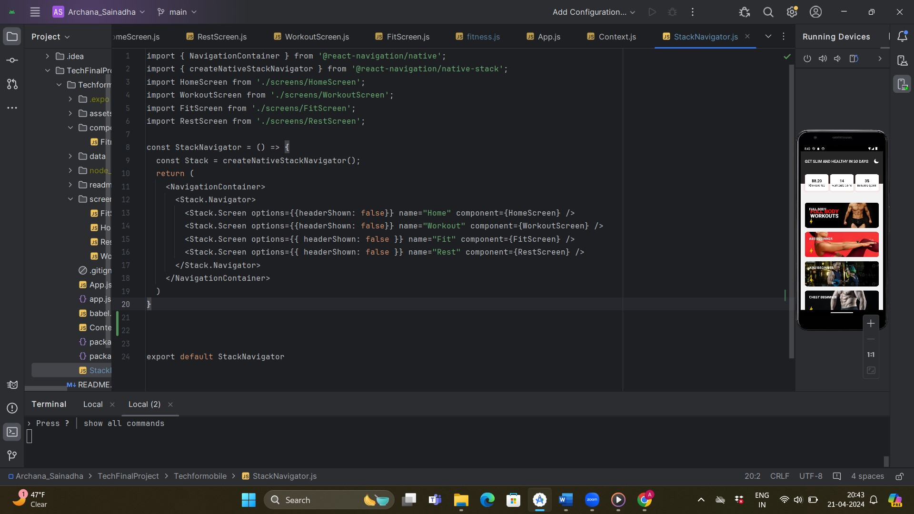

# Technologies Used
React Native
JavaScript
React
Expo
React Native Navigation

# CODE
Best to see in 67%